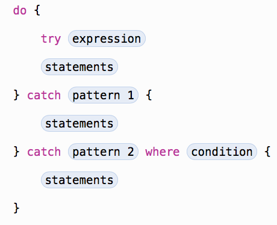

###Error Handling

In Swift, errors are represented by values of types that conform to the **Error** protocol. This empty protocol indicates that a type can be used for error handling.

Error handling is the process of responding to and recovering from error conditions in your program. Swift provides first-class support for throwing, catching, propagating, and manipulating recoverable errors at runtime.

There are four ways to handle errors in Swift. You can propagate the error from a function to the code that calls that function, handle the error using a **do-catch** statement, handle the error as an optional value, or assert that the error will not occur.

* Propagating errors using throwing functions
* Handling errors using do-catch



* Converting errors to optional values ( **try?** )
* Specifying cleanup actions

You use a defer statement to execute a set of statements just before code execution leaves the current block of code. This statement lets you do any necessary cleanup that should be performed regardless of how execution leaves the current block of code—whether it leaves because an error was thrown or because of a statement such as return or break. For example, you can use a defer statement to ensure that file descriptors are closed and manually allocated memory is freed.

A defer statement defers execution until the current scope is exited. This statement consists of the defer keyword and the statements to be executed later. The deferred statements may not contain any code that would transfer control out of the statements, such as a break or a return statement, or by throwing an error. 

```swift
	func processFile(filename: String) throws {
		if exists(filename) {
			let file = open(filename)
			defer {
				close(file)
			}

			while let line = try file.readline() {
				// work with the file
			}

			// close(file) is called here, at the end of the scope.
		}
	}	
```

