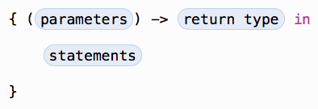

##### Function Argument Labels and Parameter Names
Each function parameter has both an *argument label* and a *parameter name*.

###### Omiting argument labels
it should write an underscore (_) instead of an explicit argument label for the parameter.

```swift
	func someFunction(_ parameterName: Int = 12) {
	}
```

####In-Out Parameters

Function parameters are constants by default. Trying to change the value of a function parameter from within the body of that function results in a compile-time error. 

This means that you can’t change the value of a parameter by mistake. If you want a function to modify a parameter’s value, and you want those changes to persist after the function call has ended, define that parameter as an in-out parameter instead.

It can only pass a variable as the argument for an in-out parameter. You cannot pass a constant or a literal value as the argument, because constants and literals cannot be modified. 

It places an **ampersand (&)** directly before a variable’s name when you pass it as an argument to an in-out parameter, to indicate that it can be modified by the function.

```swift
	func swapTwoInts(_ a: inout Int _ b: inout Int) {
		let tempA = a
		a = b
		b = tempA
	}
```

####Function Types
Every function has a __function type__, made up of the parameter types and the return type of the function.

```swift
	func addTwoInts(_ a: Int _ b: Int) {
		return a + b
	}

	var mathFunc = (Int, Int) -> Int = addTwoInts
```

#####Function Types as Paramater types

```swift
	func printMathResult(_ mathFunc: (Int, Int) -> Int), _ a: Int _ b: Int) {
		print("Result: \(mathFunc(a, b))")
	}

	var mathFunc = (Int, Int) -> Int = addTwoInts
```

####Nested functions
Nested functions are hidden from the outside world by default, but can still be called and used by their enclosing function. An enclosing function can also return one of its nested functions to allow the nested function to be used in another scope.

###Closures

Closures can capture and store references to any constants and variables from the context in which they are defined. 

Closure expressions are a way to write inline closures in a brief, focused syntax. Closure expressions provide several syntax optimizations for writing closures in a shortened form without loss of clarity or intent. 



```swift
	reverseNames = names.sorted(by: { (s1: String, s2: String) -> Bool in 
		return s1 > s2
	 })

	reverseNames = names.sorted(by: { s1, s2 in s1 > s2 })

	reverseNames = names.sorted(by: { $0 > $1 })
```

The parameters in closure expression syntax can be in-out parameters, but they can’t have a default value. Variadic parameters can be used if you name the variadic parameter. Tuples can also be used as parameter types and return types.

Swift automatically provides shorthand argument names to inline closures, which can be used to refer to the values of the closure’s arguments by the names $0, $1, $2, and so on.

#####Capturing Values
A closure can capture constants and variables from the surrounding context in which it is defined. The closure can then refer to and modify the values of those constants and variables from within its body, even if the original scope that defined the constants and variables no longer exists.

#####Functions and Closures are reference types
Whenever you assign a function or a closure to a constant or a variable, you are actually setting that constant or variable to be a reference to the function or closure.